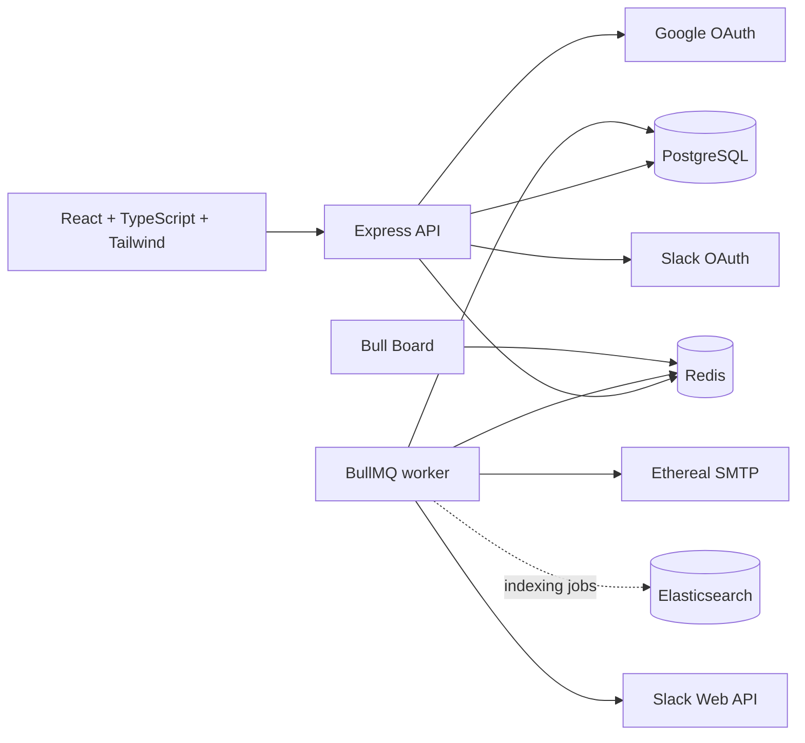
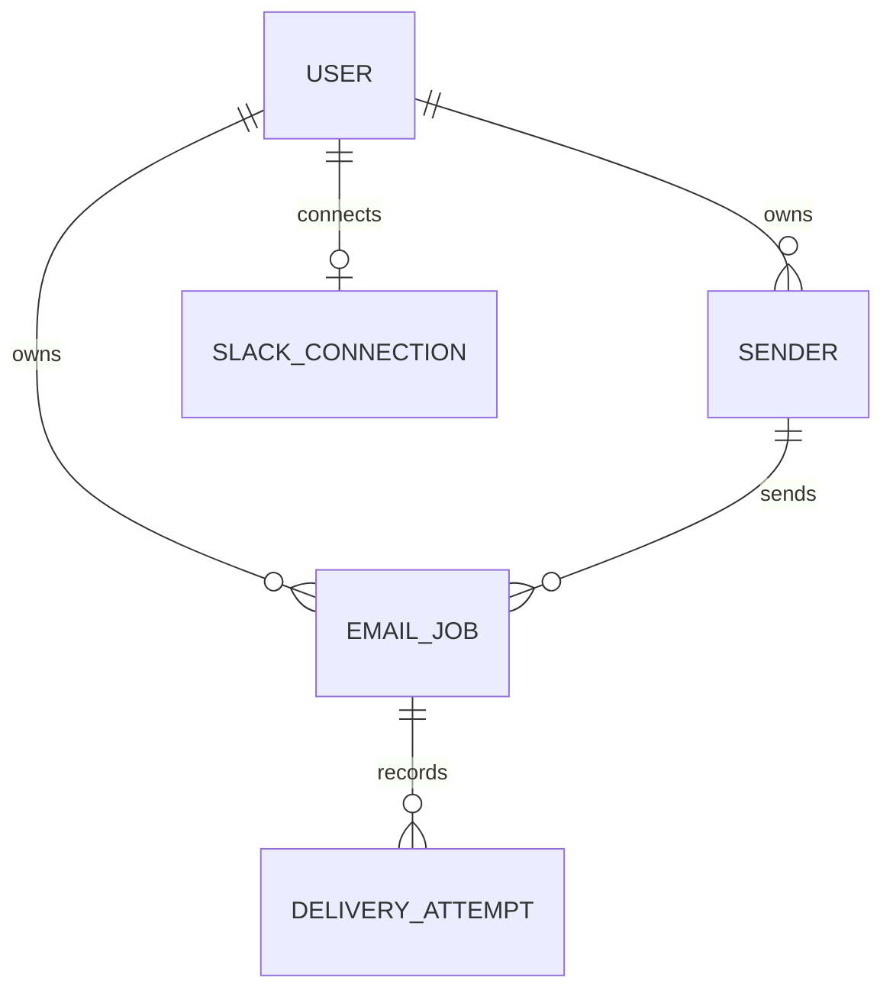

# ReachInbox Email Job Scheduler — Technical Requirements

## Architecture

PostgreSQL is the source of truth for tenant, sender, email-job, idempotency, and delivery state. Redis persists BullMQ queues and distributed sender coordination. Elasticsearch is a non-authoritative, eventually consistent search projection.

## Technology choices

| Technology | Role and justification |
| --- | --- |
| Node.js + TypeScript + Express | Typed, modular REST API with a lightweight process model. |
| Prisma + PostgreSQL | Relational state, migrations, transactions, indexes, and tenant isolation. |
| Redis + BullMQ | Durable delayed jobs and safe sharing of work between worker processes; no cron. |
| Nodemailer + Ethereal | Real SMTP delivery with inspectable previews during development. |
| Elasticsearch | Full-text search independent of source-of-truth transaction processing. |
| Google OAuth + secure session cookie | Real user authentication without exposing client secrets. |
| Slack OAuth + Web API | Persistent user-authorized notification channel. |
| React + Vite + Tailwind + TanStack Query | Typed dashboard with maintainable API state. |

## Data model

- `User`: Google identity, profile fields, timestamps.
- `Sender`: user-owned sender identity, encrypted SMTP configuration, optional per-sender limits.
- `EmailJob`: recipient, content, schedule, lifecycle status, idempotency key, BullMQ ID, timestamps, provider metadata.
- `DeliveryAttempt`: immutable record of a processing attempt and provider outcome.
- `SlackConnection`: encrypted OAuth token, team/channel metadata, and connection state.

Indexes include `(userId, status, scheduledAt)`, `(senderId, status, scheduledAt)`, and unique user-scoped idempotency and BullMQ-job identifiers.

## Scheduling and recovery

The API validates a request, normalizes/deduplicates recipients, creates `EmailJob` records transactionally, and adds a BullMQ delayed job with deterministic ID `email-<emailJobId>`. Redis persists delayed jobs. On restart, workers reconnect to existing queues; they never recreate every database row on startup. A targeted reconciliation process may restore only known rows missing their deterministic queue job.

## Idempotency and retries

The database enforces one logical email per idempotency key. Before SMTP, a worker conditionally transitions an eligible job to `PROCESSING`; duplicate or completed jobs exit without sending. BullMQ retries only retryable failures with exponential backoff. SMTP cannot provide universal exactly-once semantics if a process dies after provider acceptance but before the DB update; attempt records make that ambiguity visible and prevent blind duplicate sends.

## Distributed throttling

Redis Lua scripts make sender reservations atomic across workers and instances:

1. A per-sender next-slot key enforces `MIN_EMAIL_DELAY_MS`.
2. A per-sender UTC-hour counter admits at most `MAX_EMAILS_PER_HOUR_PER_SENDER` sends.
3. When a reservation is unavailable, the worker moves the same BullMQ job to the computed next slot/window without consuming a retry.

For 1,000 simultaneous jobs and a 200/hour cap, only 200 obtain current-hour reservations; the remainder stay durable and are rescheduled into subsequent windows. Slack notification deduplication uses a short-lived Redis key per sender/window.

## OAuth and security

Google and Slack use OAuth 2.0 authorization-code flows with CSRF state validation. Tokens and SMTP credentials are encrypted at rest; secrets are supplied through environment variables and excluded from Git. Session cookies are signed, HTTP-only, secure in production, and same-site. APIs authorize every user-owned record. Bull Board is protected by authenticated admin middleware.

## Non-functional requirements

- Configurable worker concurrency and graceful API/worker shutdown.
- Structured Pino logs with no tokens or passwords.
- Elasticsearch indexing failures are isolated from sending and retried asynchronously.
- Docker volumes persist PostgreSQL, Redis, and Elasticsearch development data.
- Health endpoints and Docker health checks provide readiness signals.

## Required external configuration

Google OAuth web-client credentials, Slack app credentials, Ethereal SMTP credentials, and secure session/encryption keys must be supplied by the operator. No credentials are committed.

## Milestone plan

| Milestone | Scope | Verification |
| --- | --- | --- |
| 0 | Initialize repository, PRD, TRD | Documents reviewed; Git initialized. |
| 1 | Project workspace and shared configuration | TypeScript workspace commands run. |
| 2 | PostgreSQL, Redis, Elasticsearch Compose infrastructure | All services healthy and reachable. |
| 3 | Express API foundation and health endpoint | API health request succeeds. |
| 4 | Prisma schema, migration, database access | Migration and DB CRUD pass. |
| 5 | Scheduling API and delayed BullMQ jobs | Persisted delayed job is visible. |
| 6 | Worker, Ethereal SMTP, retries, idempotency | Email is sent once and status changes. |
| 7 | Sender throttling and hourly rescheduling | Concurrent load respects limits. |
| 8 | Elasticsearch indexing and search API | Tenant-safe search succeeds. |
| 9 | Protected Bull Board dashboard | Queue states visible only when authorized. |
| 10 | Google OAuth and protected API sessions | Login, profile, logout work. |
| 11 | Slack OAuth and rate-limit notifications | Live Slack notification is delivered. |
| 12 | React/Tailwind frontend and Figma refinement | Dashboard workflows pass manually. |
| 13 | End-to-end reliability testing and final README | Checklist has evidence for every requirement. |

## Constraints and trade-offs

- No cron, polling scheduler, Kafka, microservices, or Kubernetes.
- Fixed UTC hourly windows are transparent and efficient; rolling windows would be stricter but more complex.
- Ethereal demonstrates SMTP delivery, not production deliverability.
- Elasticsearch is eventually consistent by design; PostgreSQL remains authoritative.
